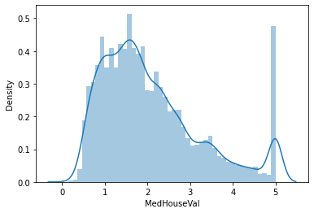
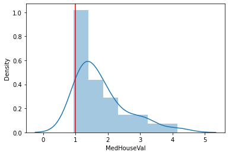
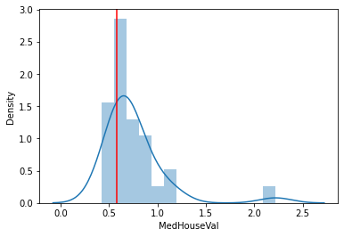

# Heartwood
> Supervised metric and not metric space learning methods for multiple purposes in Machine Learning


## What is it for?

- [X] supervised similarity matching
- [X] nomparametric density estimation
- [X] ensemble learning

## Install

`pip install your_project_name`

## How to use

```python
import seaborn as sns
from sklearn.datasets import fetch_california_housing

from heartwood.kernel import JaccardForestKernel, MLPKernel, DiscretizedTargetKernel, make_bimodal_assymetric_regression
```

```python
X_bimodal, y_bimodal = make_bimodal_assymetric_regression(10_000)
```

```python
housing = fetch_california_housing(as_frame = True)['frame']
```

```python
numerical_cols = housing.columns[:-1]
target_col = housing.columns[-1]
```

```python
housing
```


<div>
<style scoped>
    .dataframe tbody tr th:only-of-type {
        vertical-align: middle;
    }

    .dataframe tbody tr th {
        vertical-align: top;
    }

    .dataframe thead th {
        text-align: right;
    }
</style>
<table border="1" class="dataframe">
  <thead>
    <tr style="text-align: right;">
      <th></th>
      <th>MedInc</th>
      <th>HouseAge</th>
      <th>AveRooms</th>
      <th>AveBedrms</th>
      <th>Population</th>
      <th>AveOccup</th>
      <th>Latitude</th>
      <th>Longitude</th>
      <th>MedHouseVal</th>
    </tr>
  </thead>
  <tbody>
    <tr>
      <th>0</th>
      <td>8.3252</td>
      <td>41.0</td>
      <td>6.984127</td>
      <td>1.023810</td>
      <td>322.0</td>
      <td>2.555556</td>
      <td>37.88</td>
      <td>-122.23</td>
      <td>4.526</td>
    </tr>
    <tr>
      <th>1</th>
      <td>8.3014</td>
      <td>21.0</td>
      <td>6.238137</td>
      <td>0.971880</td>
      <td>2401.0</td>
      <td>2.109842</td>
      <td>37.86</td>
      <td>-122.22</td>
      <td>3.585</td>
    </tr>
    <tr>
      <th>2</th>
      <td>7.2574</td>
      <td>52.0</td>
      <td>8.288136</td>
      <td>1.073446</td>
      <td>496.0</td>
      <td>2.802260</td>
      <td>37.85</td>
      <td>-122.24</td>
      <td>3.521</td>
    </tr>
    <tr>
      <th>3</th>
      <td>5.6431</td>
      <td>52.0</td>
      <td>5.817352</td>
      <td>1.073059</td>
      <td>558.0</td>
      <td>2.547945</td>
      <td>37.85</td>
      <td>-122.25</td>
      <td>3.413</td>
    </tr>
    <tr>
      <th>4</th>
      <td>3.8462</td>
      <td>52.0</td>
      <td>6.281853</td>
      <td>1.081081</td>
      <td>565.0</td>
      <td>2.181467</td>
      <td>37.85</td>
      <td>-122.25</td>
      <td>3.422</td>
    </tr>
    <tr>
      <th>...</th>
      <td>...</td>
      <td>...</td>
      <td>...</td>
      <td>...</td>
      <td>...</td>
      <td>...</td>
      <td>...</td>
      <td>...</td>
      <td>...</td>
    </tr>
    <tr>
      <th>20635</th>
      <td>1.5603</td>
      <td>25.0</td>
      <td>5.045455</td>
      <td>1.133333</td>
      <td>845.0</td>
      <td>2.560606</td>
      <td>39.48</td>
      <td>-121.09</td>
      <td>0.781</td>
    </tr>
    <tr>
      <th>20636</th>
      <td>2.5568</td>
      <td>18.0</td>
      <td>6.114035</td>
      <td>1.315789</td>
      <td>356.0</td>
      <td>3.122807</td>
      <td>39.49</td>
      <td>-121.21</td>
      <td>0.771</td>
    </tr>
    <tr>
      <th>20637</th>
      <td>1.7000</td>
      <td>17.0</td>
      <td>5.205543</td>
      <td>1.120092</td>
      <td>1007.0</td>
      <td>2.325635</td>
      <td>39.43</td>
      <td>-121.22</td>
      <td>0.923</td>
    </tr>
    <tr>
      <th>20638</th>
      <td>1.8672</td>
      <td>18.0</td>
      <td>5.329513</td>
      <td>1.171920</td>
      <td>741.0</td>
      <td>2.123209</td>
      <td>39.43</td>
      <td>-121.32</td>
      <td>0.847</td>
    </tr>
    <tr>
      <th>20639</th>
      <td>2.3886</td>
      <td>16.0</td>
      <td>5.254717</td>
      <td>1.162264</td>
      <td>1387.0</td>
      <td>2.616981</td>
      <td>39.37</td>
      <td>-121.24</td>
      <td>0.894</td>
    </tr>
  </tbody>
</table>
<p>20640 rows × 9 columns</p>
</div>


```python
sns.distplot(housing.iloc[:,-1])
```


    <AxesSubplot:xlabel='MedHouseVal', ylabel='Density'>





# JaccardForestKernel
> uses forest node embeddings and jaccard similarity to sample points

```python
from sklearn.ensemble import ExtraTreesRegressor, RandomForestRegressor
from sklearn.model_selection import train_test_split

learner = JaccardForestKernel(
    RandomForestRegressor(n_jobs = -1),
    fit_neighbors_index = True,
    verbose = True
)
```

```python
housing_train, housing_test = train_test_split(housing, train_size = 0.8)
```

```python
learner.fit(
    housing_train[numerical_cols],
    housing_train[target_col],
    save_values = housing_train
)
```


    JaccardForestKernel(estimator=RandomForestRegressor(n_jobs=-1), verbose=True)


```python
queries = learner.query(housing_test[numerical_cols])
```

    kNN time total=1.645799 (sec), per query=0.000399 (sec), per query adjusted for thread number=0.001595 (sec)
    

```python
import numpy as np
import matplotlib.pyplot as plt

idx = np.random.choice(len(housing_test))
q = queries[0][idx]
q['similarity'] = queries[1][idx]

sns.distplot(q[target_col])
plt.axvline(housing_test.iloc[idx][target_col], color = 'r')

```


    <matplotlib.lines.Line2D at 0x17834339e08>





```python
q[:10]
```


<div>
<style scoped>
    .dataframe tbody tr th:only-of-type {
        vertical-align: middle;
    }

    .dataframe tbody tr th {
        vertical-align: top;
    }

    .dataframe thead th {
        text-align: right;
    }
</style>
<table border="1" class="dataframe">
  <thead>
    <tr style="text-align: right;">
      <th></th>
      <th>MedInc</th>
      <th>HouseAge</th>
      <th>AveRooms</th>
      <th>AveBedrms</th>
      <th>Population</th>
      <th>AveOccup</th>
      <th>Latitude</th>
      <th>Longitude</th>
      <th>MedHouseVal</th>
      <th>similarity</th>
    </tr>
  </thead>
  <tbody>
    <tr>
      <th>2552</th>
      <td>2.2227</td>
      <td>30.0</td>
      <td>5.278552</td>
      <td>1.019499</td>
      <td>990.0</td>
      <td>2.757660</td>
      <td>40.77</td>
      <td>-124.17</td>
      <td>0.813</td>
      <td>0.907104</td>
    </tr>
    <tr>
      <th>2648</th>
      <td>2.2357</td>
      <td>30.0</td>
      <td>5.152406</td>
      <td>1.050802</td>
      <td>996.0</td>
      <td>2.663102</td>
      <td>40.50</td>
      <td>-124.10</td>
      <td>0.723</td>
      <td>0.913043</td>
    </tr>
    <tr>
      <th>2636</th>
      <td>2.0938</td>
      <td>39.0</td>
      <td>5.594340</td>
      <td>1.122642</td>
      <td>539.0</td>
      <td>2.542453</td>
      <td>40.59</td>
      <td>-124.15</td>
      <td>0.796</td>
      <td>0.924731</td>
    </tr>
    <tr>
      <th>2575</th>
      <td>2.2478</td>
      <td>31.0</td>
      <td>5.123810</td>
      <td>1.100000</td>
      <td>1259.0</td>
      <td>2.997619</td>
      <td>40.80</td>
      <td>-124.13</td>
      <td>0.811</td>
      <td>0.924731</td>
    </tr>
    <tr>
      <th>19788</th>
      <td>2.4792</td>
      <td>26.0</td>
      <td>6.129121</td>
      <td>1.156593</td>
      <td>987.0</td>
      <td>2.711538</td>
      <td>40.71</td>
      <td>-122.95</td>
      <td>0.888</td>
      <td>0.941799</td>
    </tr>
    <tr>
      <th>2650</th>
      <td>2.3947</td>
      <td>38.0</td>
      <td>5.536160</td>
      <td>1.062344</td>
      <td>1041.0</td>
      <td>2.596010</td>
      <td>40.44</td>
      <td>-124.09</td>
      <td>0.705</td>
      <td>0.947368</td>
    </tr>
    <tr>
      <th>19763</th>
      <td>2.2500</td>
      <td>30.0</td>
      <td>5.861862</td>
      <td>1.192192</td>
      <td>961.0</td>
      <td>2.885886</td>
      <td>40.02</td>
      <td>-122.18</td>
      <td>0.682</td>
      <td>0.963731</td>
    </tr>
    <tr>
      <th>2662</th>
      <td>2.0870</td>
      <td>33.0</td>
      <td>6.141975</td>
      <td>1.216049</td>
      <td>1221.0</td>
      <td>2.512346</td>
      <td>40.12</td>
      <td>-123.82</td>
      <td>0.824</td>
      <td>0.969072</td>
    </tr>
    <tr>
      <th>18794</th>
      <td>2.1250</td>
      <td>22.0</td>
      <td>6.856688</td>
      <td>1.468153</td>
      <td>903.0</td>
      <td>2.875796</td>
      <td>40.40</td>
      <td>-122.76</td>
      <td>1.232</td>
      <td>0.969072</td>
    </tr>
    <tr>
      <th>1860</th>
      <td>2.1336</td>
      <td>19.0</td>
      <td>5.893993</td>
      <td>1.144876</td>
      <td>841.0</td>
      <td>2.971731</td>
      <td>41.92</td>
      <td>-124.16</td>
      <td>0.750</td>
      <td>0.974359</td>
    </tr>
  </tbody>
</table>
</div>


# DiscretizedTargetKernel
> conditional target distribution could be bimodal, making regular regression faill. discretizing and running a classification might help

```python
from sklearn.linear_model import LogisticRegression
from sklearn.pipeline import make_pipeline
from sklearn.preprocessing import RobustScaler
```

```python
disc_learner = DiscretizedTargetKernel(
    estimator = make_pipeline(RobustScaler(), LogisticRegression()),
    n_bins = 15,
    strategy = 'uniform'
)

```

```python
disc_learner.fit(
    housing_train[numerical_cols],
    housing_train[[target_col]],
    save_values = housing_train
)
```


    DiscretizedTargetKernel(estimator=Pipeline(steps=[('robustscaler',
                                                       RobustScaler()),
                                                      ('logisticregression',
                                                       LogisticRegression())]),
                            n_bins=15, strategy='uniform')


```python
disc_queries = disc_learner.query(housing_test[numerical_cols])
```

```python
idx = np.random.choice(len(housing_test))
q = disc_queries[0][idx]
q['kldivergence'] = disc_queries[1][idx]

sns.distplot(q[target_col])
plt.axvline(housing_test.iloc[idx][target_col], color = 'r')

```


    <matplotlib.lines.Line2D at 0x1782f883fc8>





```python
q[:10]
```


<div>
<style scoped>
    .dataframe tbody tr th:only-of-type {
        vertical-align: middle;
    }

    .dataframe tbody tr th {
        vertical-align: top;
    }

    .dataframe thead th {
        text-align: right;
    }
</style>
<table border="1" class="dataframe">
  <thead>
    <tr style="text-align: right;">
      <th></th>
      <th>MedInc</th>
      <th>HouseAge</th>
      <th>AveRooms</th>
      <th>AveBedrms</th>
      <th>Population</th>
      <th>AveOccup</th>
      <th>Latitude</th>
      <th>Longitude</th>
      <th>MedHouseVal</th>
      <th>kldivergence</th>
    </tr>
  </thead>
  <tbody>
    <tr>
      <th>12947</th>
      <td>4.8661</td>
      <td>24.0</td>
      <td>6.358456</td>
      <td>1.053309</td>
      <td>1336.0</td>
      <td>2.455882</td>
      <td>38.64</td>
      <td>-121.28</td>
      <td>1.862</td>
      <td>0.002280</td>
    </tr>
    <tr>
      <th>19666</th>
      <td>4.6010</td>
      <td>34.0</td>
      <td>6.320329</td>
      <td>0.979466</td>
      <td>1226.0</td>
      <td>2.517454</td>
      <td>37.51</td>
      <td>-120.83</td>
      <td>1.500</td>
      <td>0.002638</td>
    </tr>
    <tr>
      <th>16450</th>
      <td>4.1190</td>
      <td>38.0</td>
      <td>5.506876</td>
      <td>0.982318</td>
      <td>1223.0</td>
      <td>2.402750</td>
      <td>38.14</td>
      <td>-121.28</td>
      <td>1.288</td>
      <td>0.003778</td>
    </tr>
    <tr>
      <th>12731</th>
      <td>5.0508</td>
      <td>32.0</td>
      <td>7.575688</td>
      <td>1.100917</td>
      <td>1185.0</td>
      <td>2.717890</td>
      <td>38.59</td>
      <td>-121.36</td>
      <td>2.257</td>
      <td>0.003865</td>
    </tr>
    <tr>
      <th>20559</th>
      <td>4.7222</td>
      <td>30.0</td>
      <td>6.424691</td>
      <td>0.990123</td>
      <td>981.0</td>
      <td>2.422222</td>
      <td>38.67</td>
      <td>-121.79</td>
      <td>1.672</td>
      <td>0.004230</td>
    </tr>
    <tr>
      <th>12727</th>
      <td>4.4643</td>
      <td>35.0</td>
      <td>5.710059</td>
      <td>0.970414</td>
      <td>805.0</td>
      <td>2.381657</td>
      <td>38.60</td>
      <td>-121.36</td>
      <td>1.330</td>
      <td>0.004297</td>
    </tr>
    <tr>
      <th>1534</th>
      <td>4.2625</td>
      <td>37.0</td>
      <td>5.925795</td>
      <td>0.950530</td>
      <td>689.0</td>
      <td>2.434629</td>
      <td>37.89</td>
      <td>-122.05</td>
      <td>3.106</td>
      <td>0.004309</td>
    </tr>
    <tr>
      <th>19057</th>
      <td>4.2813</td>
      <td>33.0</td>
      <td>6.340426</td>
      <td>1.117021</td>
      <td>212.0</td>
      <td>2.255319</td>
      <td>38.13</td>
      <td>-121.84</td>
      <td>0.813</td>
      <td>0.004316</td>
    </tr>
    <tr>
      <th>18894</th>
      <td>4.0938</td>
      <td>37.0</td>
      <td>5.979592</td>
      <td>1.046382</td>
      <td>1325.0</td>
      <td>2.458256</td>
      <td>38.13</td>
      <td>-122.24</td>
      <td>1.269</td>
      <td>0.005845</td>
    </tr>
    <tr>
      <th>2040</th>
      <td>4.9196</td>
      <td>27.0</td>
      <td>6.184783</td>
      <td>0.906522</td>
      <td>1219.0</td>
      <td>2.650000</td>
      <td>36.73</td>
      <td>-119.67</td>
      <td>1.179</td>
      <td>0.006963</td>
    </tr>
  </tbody>
</table>
</div>


